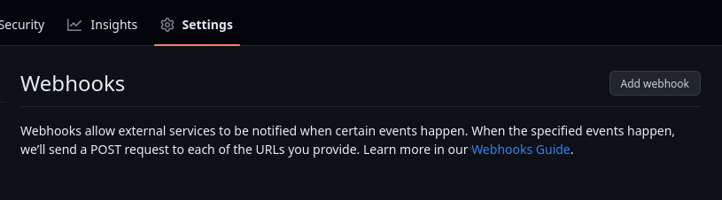
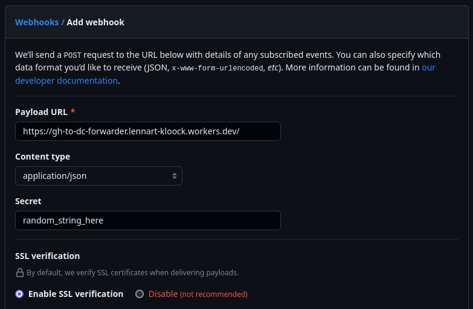
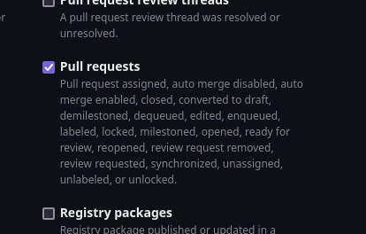

# Github to Discord Webhook Forwarder

## Worker setup

Clone this repository and install the dependencies with `npm install`.

Set the right `REVIEWERS_ROLE_ID` in `wrangler.toml`.

Set the `GH_SECRET` secret to a random string by running `echo random_string_here | wrangler secret put GH_SECRET`.

Set the `WEBHOOK_URL` secret by running `echo https://discord.com/api/webhooks/... | wrangler secret put WEBHOOK_URL`.

Run `wrangler deploy` to deploy the worker.

## Github Setup

Create a new webhook in your Github repository settings.

Put in the URL of your worker, select `application/json` as the content type and use a the random secret you set earlier.

Select "Let me select individual events" and check "Pull requests".

After that, press "Add webhook" and you're done!
